## 行为模式
行为模式主要用于对象间高效沟通和职责委派
行为模式包括：责任链、命令、迭代器、中介者、备忘录、观察者、状态、策略、模板、访问者，这10类。
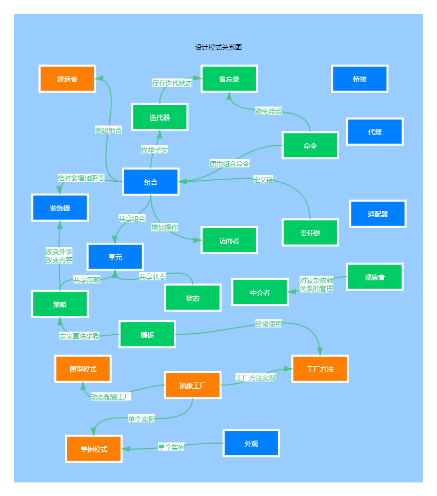

### 实战责任链模式「模拟618电商大促期间，项目上线流程多级负责人审批场景」
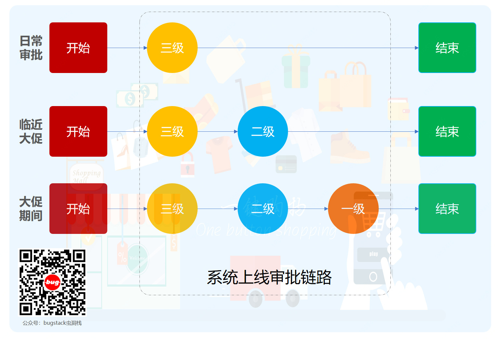
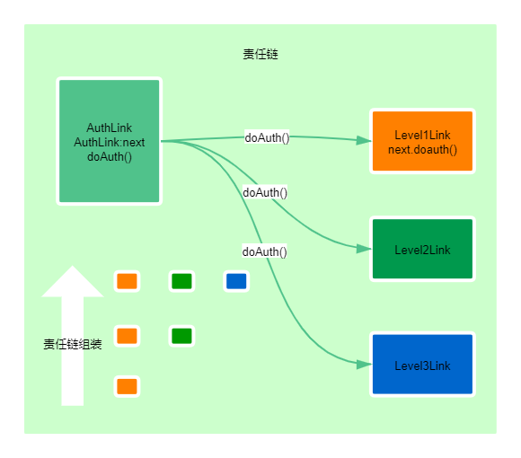
### 实战命令模式「模拟高档餐厅八大菜系，小二点单厨师烹饪场景」
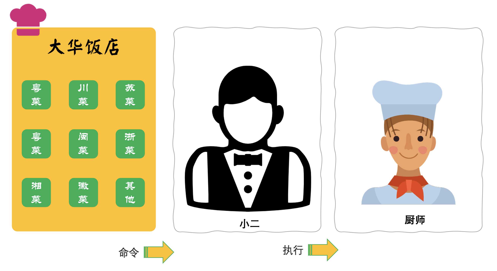
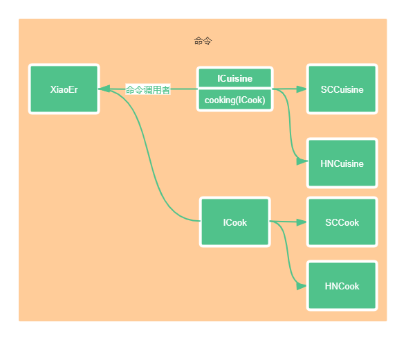
### 实战迭代器模式「模拟公司组织架构树结构关系，深度迭代遍历人员信息输出场景」
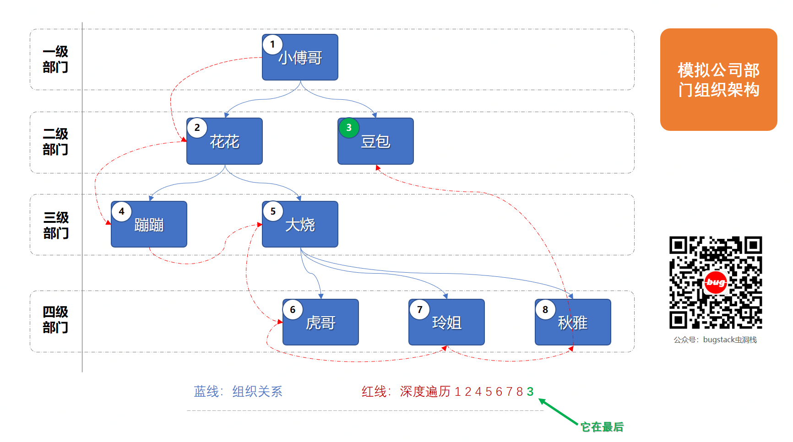

### 实战中介者模式「按照Mybatis原理手写ORM框架，给JDBC方式操作数据库增加中介者场景」
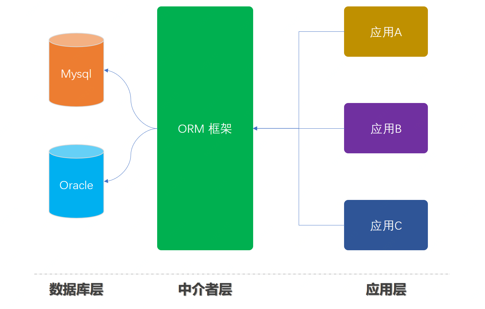
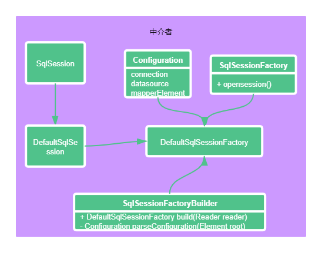
### 实战备忘录模式「模拟互联网系统上线过程中，配置文件回滚场景」
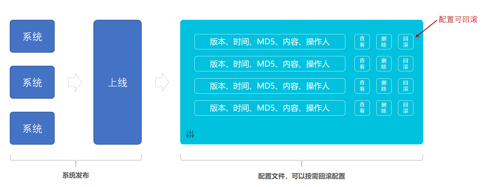
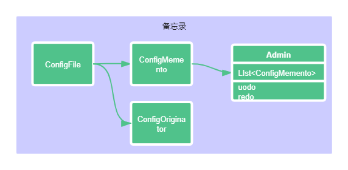
### 实战观察者模式「模拟类似小客车指标摇号过程，监听消息通知用户中签场景」
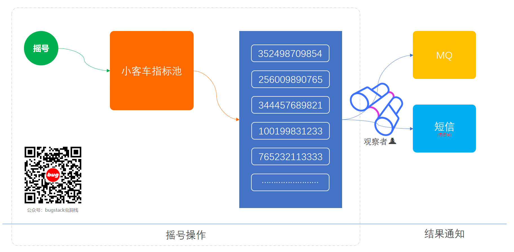
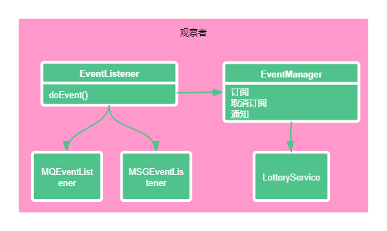
### 实战状态模式「模拟系统营销活动，状态流程审核发布上线场景」
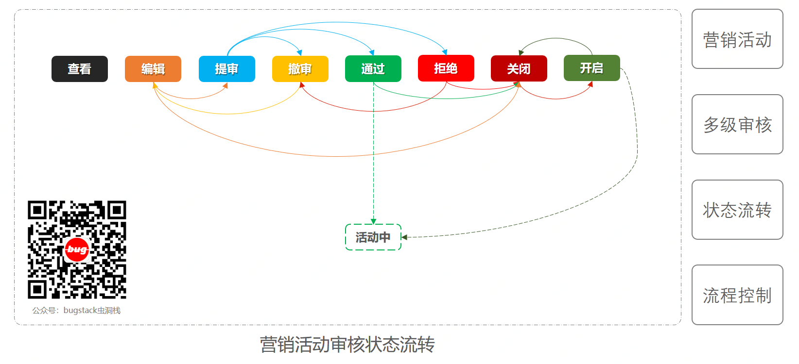

### 实战策略模式「模拟多种营销类型优惠券，折扣金额计算策略场景」

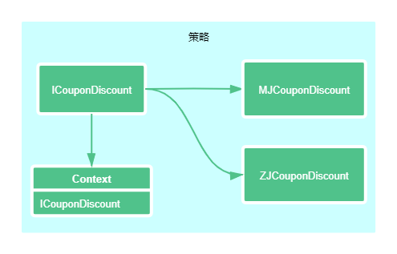
### 实战模版模式「模拟爬虫各类电商商品，生成营销推广海报场景」
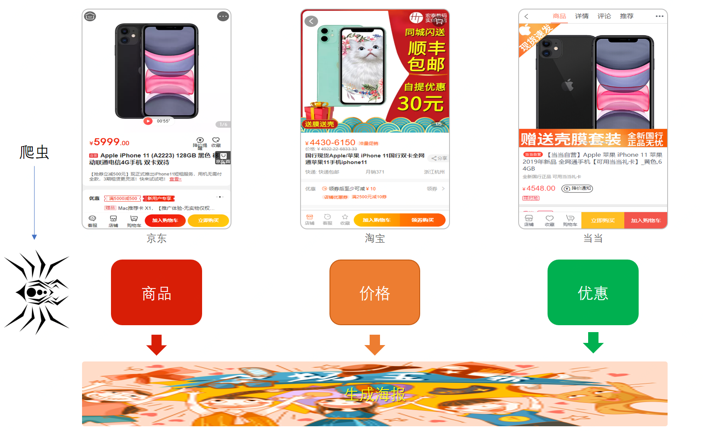
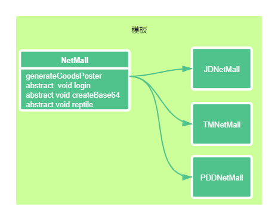
### 实战访问者模式「模拟家长与校长，对学生和老师的不同视角信息的访问场景」
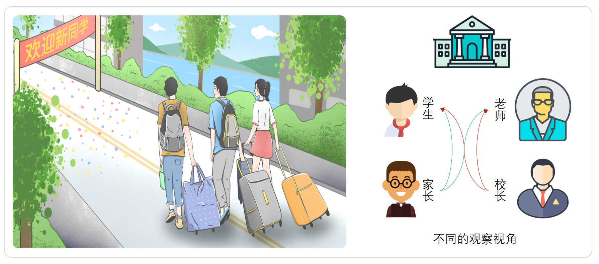
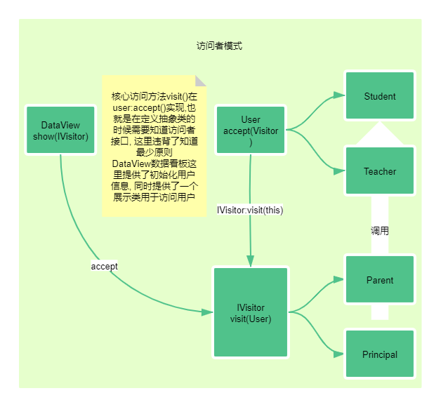

