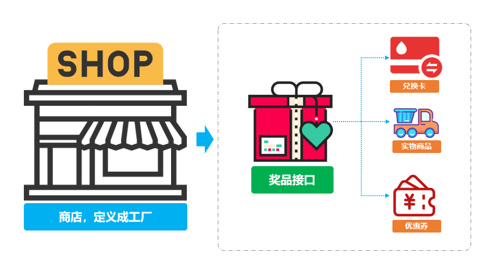
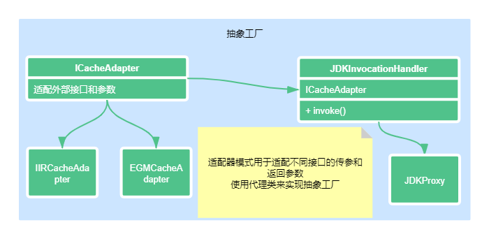
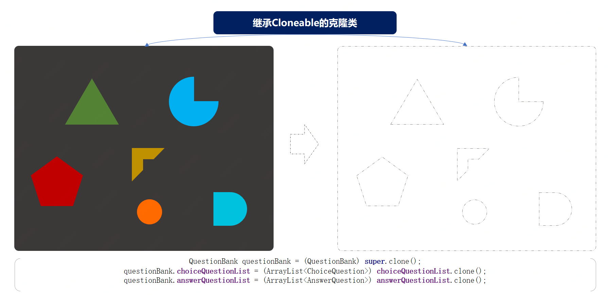

## 创建型模式
创建型模式主要提供创建对象的机制, 提高代码的灵活性和可复用性
包括工厂方法, 抽象工厂, 建造者, 原型模式, 单例模式

### 实战工厂方法模式「多种类型商品不同接口，统一发奖服务搭建场景」

### 实战抽象工厂模式「替换Redis双集群升级，代理类抽象场景」

### 实战建造者模式「各项装修物料组合套餐选配场景」

### 实战原型模式「上机考试多套试，每人题目和答案乱序排列场景」

### 实战单例模式「7种单例模式案例，Effective Java 作者推荐枚举单例模式」

