## 结构型模式
这类模式介绍如何将对象和类组装成较⼤大的结构，并同时保持结构的灵活和⾼高效。
结构型模式包括：适配器、桥接、组合、装饰器、外观、享元、代理，这7类。

### 实战适配器模式「从多个MQ消息体中，抽取指定字段值场景」)

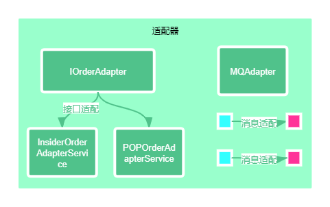
### 实战桥接模式「多支付渠道(微信、支付宝)与多支付模式(刷脸、指纹)场景」

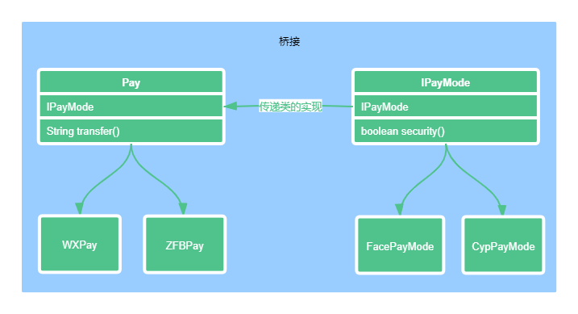
### 实战组合模式「营销差异化人群发券，决策树引擎搭建场景」
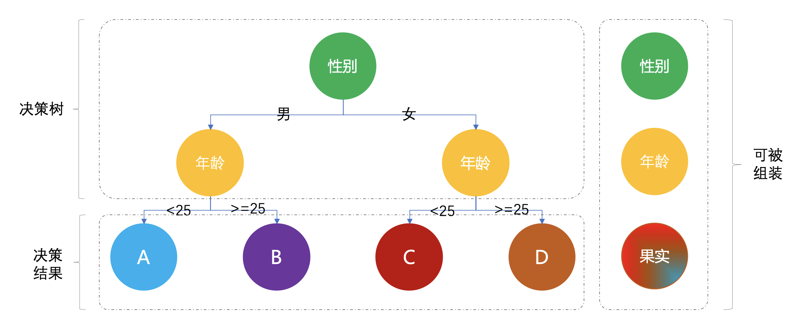
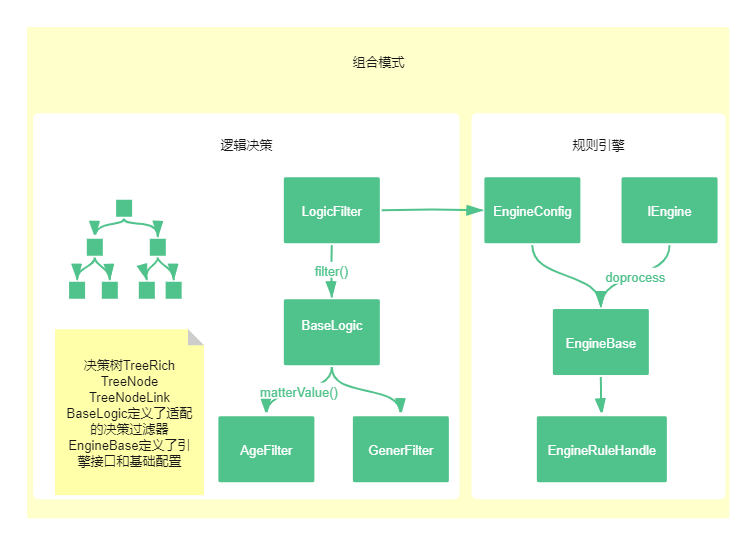
### 实战装饰器模式「SSO单点登录功能扩展，增加拦截用户访问方法范围场景」
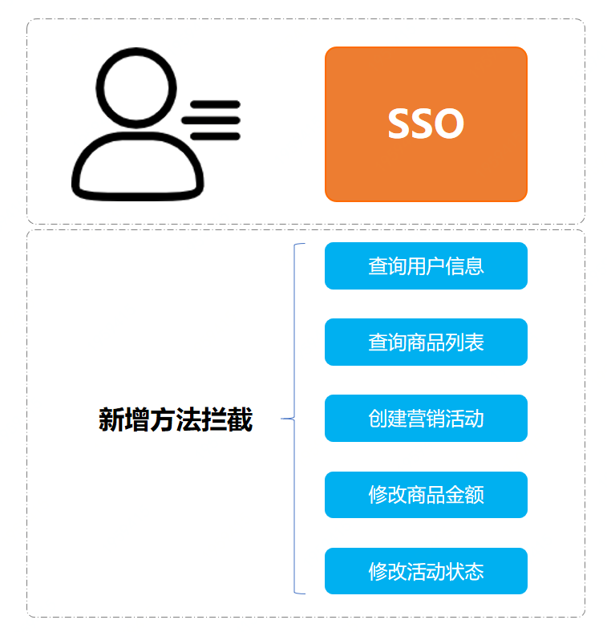
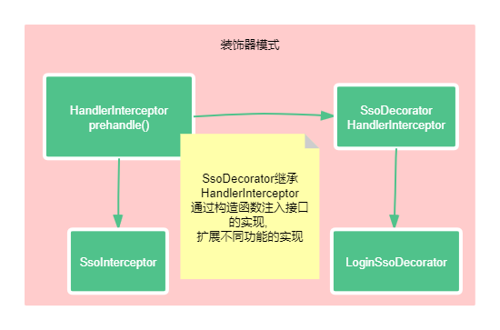
### 实战外观模式「基于SpringBoot开发门面模式中间件，统一控制接口白名单场景」
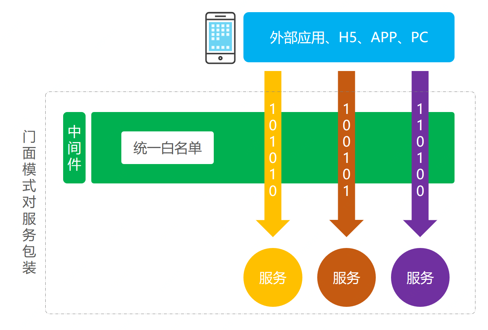
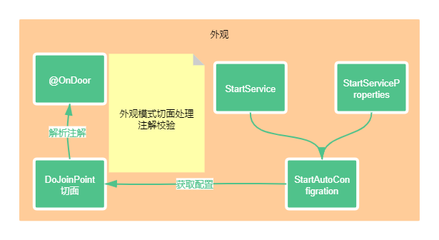
### 实战享元模式「基于Redis秒杀，提供活动与库存信息查询场景」
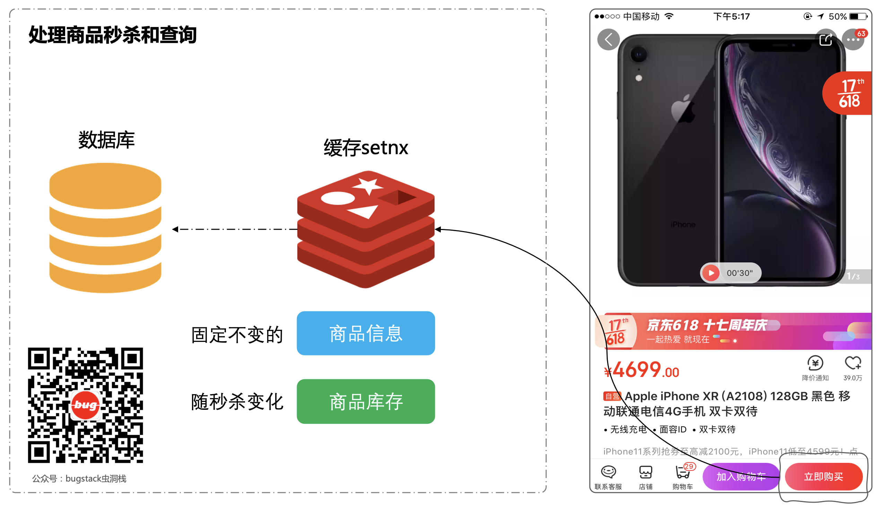
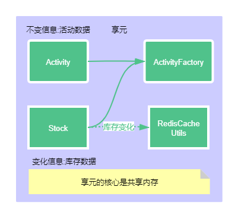
### 实战代理模式「模拟mybatis-spring中定义DAO接口，使用代理类方式操作数据库原理实现场景」
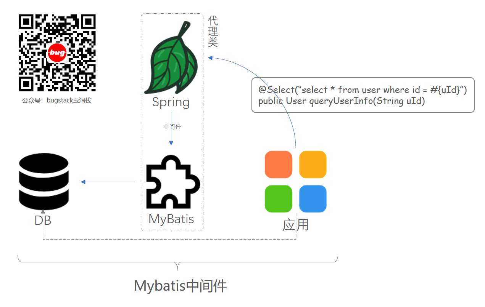
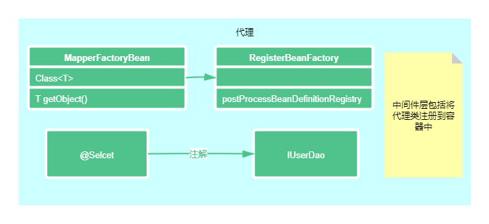